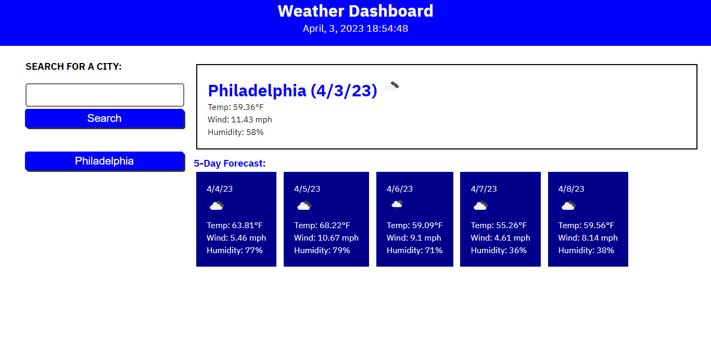

# weather-dashboard-api

## Description
The reason I created the weather dashboard api application is to have an easy way to search cities and get a current day weather forecast along with a 5-day forecast so in all 6 days of weather. My son enjoyed thinking of cities to search for in the inpujt box and hitting the search button. The weather icon will give you the weather outlook for the day along with temperature, wind speed, and humidity. The city will be saved in your search history and you could click on it again to see the forecast. 

## Installation
N/A

## Usage
Upon loading the webpage you will greeted with weather for Philadelphia. Then in the input field above the search you can type in a city. Click the search button and you will be given the current day forecast with the above categories and the next 5 days after the current day. 

The deployed page is here: https://tgold1.github.io/weather-dashboard-api/

## Collaborators
N/A

## License
N/A 